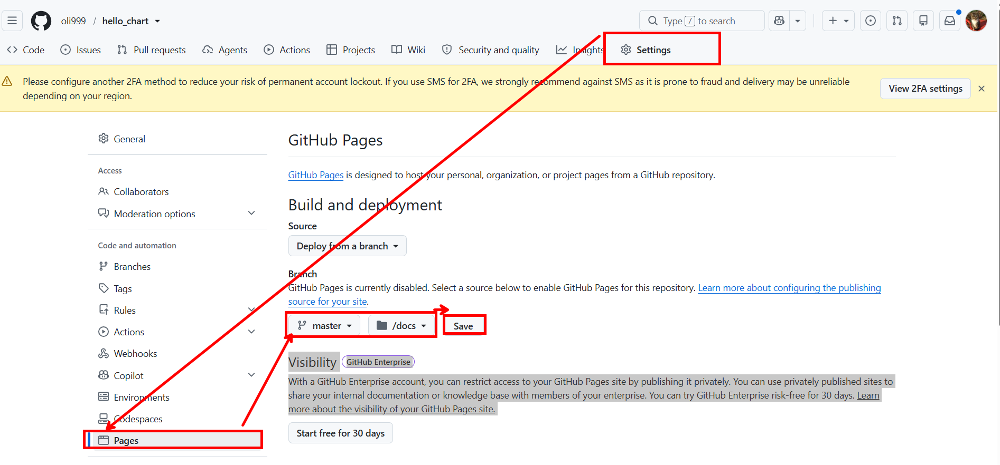
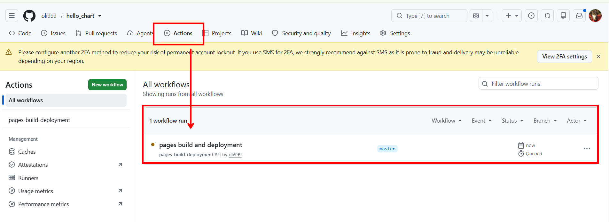

```bash
# 1. 깃허브 페이지가 바라볼 배포용 폴더(docs) 생성
mkdir -p docs

# 2. 우리가 만든 차트를 압축(.tgz)해서 docs/ 폴더 안에 저장!
helm package charts/helm01_member -d docs/

# docs/ 폴더 안의 내용물을 스캔해서 index.yaml 파일을 생성하라!
helm repo index docs/ --url https://oli999.github.io/chart_test/
```

## github pages 로 나만의 helm chart 저장소 만들기

```bash
# 깃 초기화 및 원격 저장소 연결
git init
git remote add origin https://github.com/<내-깃허브-ID>/my-helm-charts.git

echo "*.tgz" >> .gitignore
echo "index.yaml" >> .gitignore

# 깃허브에 소스 코드 푸시
git add .
git commit -m "feat: initial helm chart source"
git branch -M master
git push -u origin master

# 1. 깃허브 페이지용 배포 파일을 모아둘 임시 폴더(docs)를 만듭니다. (이름은 자유지만 docs가 매핑하기 편합니다)
mkdir docs

# 2. 헬름 차트를 압축해서 docs 폴더에 넣습니다. (member-app-1.0.0.tgz 같은 파일이 생성됨)
helm package helm01_member -d docs/

# 3. 🌟 가장 중요한 명령어! 헬름 저장소의 핵심인 '명세서(index.yaml)'를 생성합니다.
# 뒤에 붙는 URL은 내 깃허브 페이지의 "최종 웹 주소"가 될 곳을 미리 적어주는 것입니다!
helm repo index docs/ --url https://<내-깃허브-ID>.github.io/my-helm-charts/

git add docs/
git commit -m "release: member-app chart v1.0.0 package"
git push origin master
```




```bash
# https://oli999.github.io/hello_chart/
# 1. 내가 만든 GitHub Pages 주소를 내 PC 헬름에 저장소로 등록합니다.
helm repo add my-repo https://oli999.github.io/hello_chart/

# 2. 저장소의 최신 정보를 동기화합니다.
helm repo update

# 3. 🌟 내 저장소에 member-app이 잘 검색되는지 확인합니다!
helm search repo my-repo
```

```bash

helm install member-release . -n helm01
helm install member-release . -n helm01 --create-namespace
helm upgrade my-release .
helm upgrade my-release . --set replicaCount=5
helm history my-release
helm rollback my-release 1
helm uninstall my-release

```